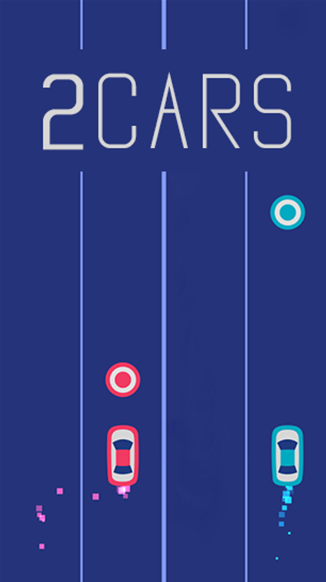

# LTNC
2Cars

Phạm Anh Tú - 22029055

Link DEMO and Run Game: https://drive.google.com/drive/folders/1lwFWrIq_ZYD77oKpMUpJ98iGPokJi-Di?usp=sharing

Intruction:
- Moving 2 cars in different line to dogde SQUARE and eat CIRCLE to earn point
- How to play:
    - Two cars (blue and red) move left and right on separate lanes.
    - Obstacles (circles and squares) fall from the top of the screen.
    - Players must collect circles to increase their score and avoid squares.
    - Missing a circle or hitting a square ends the game.
    - The game gets progressively harder as the level increases (obstacles move faster, and the distance between them decreases).
- Hot keys:
    - ->/a :Switch blue car 's line 
    - <-/d :Switch red car 's line
    - Enter/Space :Play/Replay/Pause/Continues
    - Esc :Quit

- Function:
    - Music On/Off
    - Velocity and Number of Obstacle increase through time

DEMO                                                                                                                           
                                                                                             

Source code game:
- Core Structure:
    - Classes:
        - Texture: A base class for handling textures (images) in the game. It loads images, renders them on the screen, and manages their dimensions.
        - LButton: Inherits from Texture and represents clickable buttons in the game.
        - Text: Inherits from Texture and specializes in rendering text on the screen using SDL_ttf.
        - Score: Inherits from Texture and renders the score and high score values.
        - BlueCar and RedCar: Represent the two player-controlled cars. They handle input (left/right movement), update their positions, and render themselves on the screen.
        - Obstacle: Represents the obstacles (circles and squares) that the cars must avoid or collect. It handles obstacle creation, movement, and rendering.

    - Global variables:
        - gWindow and gRenderer: The main SDL window and renderer for displaying graphics.
        - gFont: The font used for rendering text.
        - mOpen, mPause, mGameOver*, mClick, mHighScore, mScore: Sound effects and music for the game.
        - gBackground, gPlay, gDarkBackground, etc.: Textures used in the game.
        - blueCar, redCar: Instances of the car classes.

- main functions:
    - init(): Initializes SDL, creates the window and renderer, and sets up SDL_image, SDL_ttf, and SDL_mixer.
    - loadAudio(), loadMedia(), loadBackground(), loadBlueCar(), loadRedCar(), loadDot(): Load various game assets (sounds, images).
    - close(): Frees resources and shuts down SDL.
    - hitASquare(): Checks if a car has collided with a square obstacle, ending the game, or a dot obstacle, increasing the score.
    - missAPoint(): Checks if a dot obstacle has passed the screen without being collected, ending the game.
    - main():
        - Initializes the game and loads media.
        - Implements the main game loop.
        - Handles different game states:
            - home: Displays the main menu with Play and High Score buttons.
            - pause: Displays the pause screen with Continue and Home buttons.
            - play: Runs the actual gameplay:
                - Handles car movement based on user input.
                - Creates and updates obstacle positions.
                - Checks for game over conditions.
                - Renders the game scene.
                - Updates the score and level.
            - replay: Displays the game over screen with the score, high score, and Replay and Home buttons.

References:
- Code: 
    - https://github.com/rsharifnasab/sbu_2cars
    - https://github.com/nasourim/TwoCars-Simple-CLI
- Graphics: Capture 2cars game on CHPlay
- Sound: [freesound.org ](https://freesound.org/)
- Font: 
    - https://fonts2u.com/alien-league-bold.font
    - https://www.dafont.com/gasalt.font

